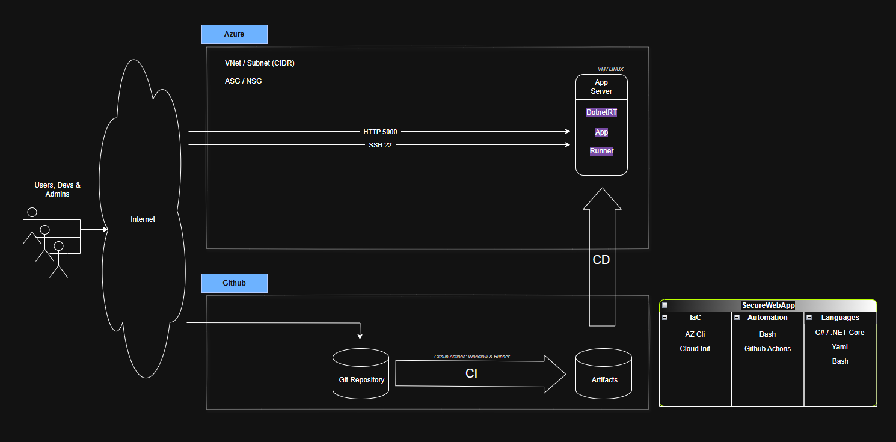
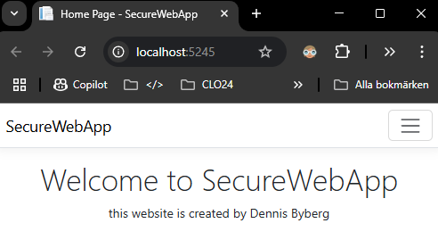
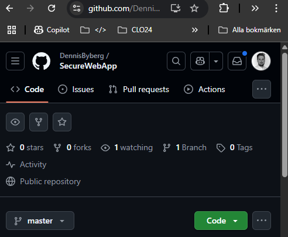
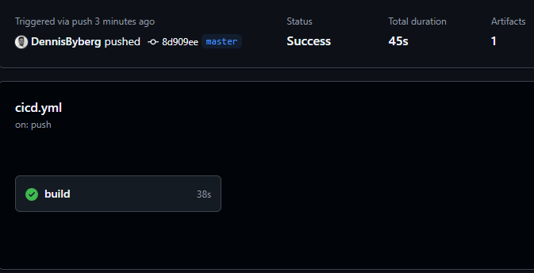
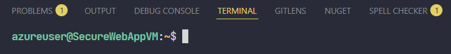
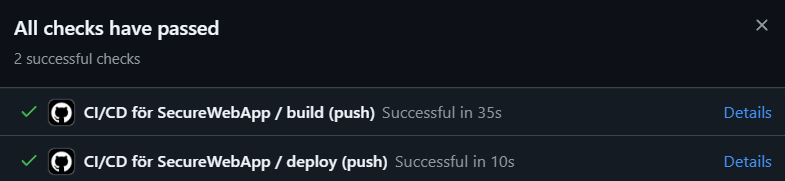
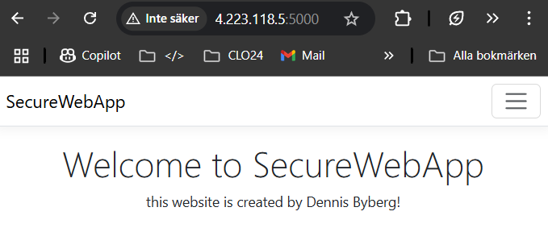

# SecureWebApp Tutorial 🛡️🔐

## Förutsättningar

Jag har precis avslutat utvecklingen av min webbapplikation skriven i .NET. Webbapplikationen är nu redo att driftsättas så att alla mina fans där ute på internet kan surfa till den och få den där wow-upplevelsen som de vet att de alltid får när jag släpper ny programkod - vilket jag gör ganska ofta.

Lite tråkigt är det emellertid att hackergruppen "Cloud Just Means Rain" ständigt ger sig på min sajt. Men med mitt senaste arbete kring säkerhet, så kommer de ingen vart.

## Uppgift

1. Jag ska designa en säker driftsmiljö för min webbapplikation.
2. Jag ska basera lösningen på virtuella servrar på Azure.
3. Jag ska beskriva vad de olika komponenterna i min design har för uppgift och syfte.
4. Jag ska beskriva vilka åtgärder jag vidtagit för ökad säkerhet.
5. Jag ska redogöra för vilka molntjänster jag utnyttjat.
6. Jag ska göra en tydlig avgränsning i min design och beskriva sedan steg för steg hur jag provisionerar driftsmiljön samt driftsätter min applikation.
7. Jag ska vara tydlig med vilka verktyg jag använder.
8. Jag ska beskriva hur jag använder IaC och automation - om jag gör det.
9. Jag ska förklara hur säkerheten påverkar min provisionering och driftsättning.

## Git & CI/CD

## Slutmål



### Steg 1: Web-App redo för versionshantering.

Nu är vår webbapplikation redo för versionshantering och fungerar lokalt.



Vi ska nu gå igenom några steg för att ladda upp den till vårt GitHub-repo där vi kommer att versionshantera vår app.

Vi börjar med att skapa en `.gitignore`-fil för att undvika att ladda upp filer som vi inte behöver på `GitHub`.

```bash
dotnet new gitignore
```

Nästa steg är att initialisera vårt git-repo och göra vår första commit.

```bash
git init
```

```bash
git add .
```

```bash
git commit -m "Initial Commit"
```

Till sist, använd VSCode:s integrerade git-funktionalitet för att koppla ditt lokala repository till GitHub och pusha din första commit. Följ anvisningarna i VSCode för att autentisera och specificera dina repository-detaljer på GitHub.

När vi är klara borde vi ha vårt repo på GitHub:


<hr>

### Steg 2: Konfigurera CI-arbetsflödet

Nu ska vi ta detta till nästa nivå och sätta upp våran CI arbetsflöde

Vi börjar med att skapa en `cicd.yml` i `.github/workflows`

```yml
name: CI för SecureWebApp

on:
  push:
    branches:
      - 'master'
  workflow_dispatch:

jobs:
  build:
    runs-on: ubuntu-latest
    steps:
      - name: Installera .NET SDK
        uses: actions/setup-dotnet@v4
        with:
          dotnet-version: '9.0.x'

      - name: Checka ut detta repo
        uses: actions/checkout@v4

      - name: Återställ beroenden (installera NuGet-paket)
        run: dotnet restore

      - name: Bygg och publicera appen
        run: |
          dotnet build --no-restore
          dotnet publish -c Release -o ./publish

      - name: Ladda upp app-artifacts till GitHub
        uses: actions/upload-artifact@v4
        with:
          name: app-artifacts
          path: ./publish
```

När vi är klara med detta så pushar vi vår kod till GitHub. Detta kommer att trigga en körning av vårt CI-arbetsflöde, vilket automatiskt kommer att bygga och publicera vår applikation samt ladda upp artefakterna till GitHub.



#### Slutsats

Genom att följa dessa steg har vi nu satt upp ett automatiserat CI-arbetsflöde som hjälper oss att säkerställa att vår applikation alltid är byggd och publicerad korrekt.

<hr>

### Steg 3: Provisionera Azure VM

Vi ska nu provisionera en virtuell maskin på Azure för att driftsätta vår webbapplikation.

Jag kommer välja att använda Azure CLI för att skapa vår virtuella maskin. Skapa en ny mapp i ditt projekt som heter `infrastructure` och skapa en ny fil som heter `provision-vm.sh`.
I denna fil kommer vi att skriva vår skript för att skapa vår virtuella maskin.

```bash
#!/bin/bash

# ------------------------------------
# Sammanfattning av vad som skapas:
# ------------------------------------
# Resursgrupp
# VM med OS-disk
# Virtuellt nätverk med subnät
# Offentlig IP-adress
# Nätverksgränssnitt
# Nätverkssäkerhetsgrupp med regler för: SSH (port 22) & applikationsport (5000)
# SSH-nyckelpar för autentisering
# Lagringskonto för diagnostik
# ------------------------------------

RESOURCE_GROUP="SecureWebAppRG" # Resource group for the VM
VM_NAME="SecureWebAppVM"        # Name of the VM
VM_PORT="5000"                  # Port to open for the application
LOCATION="swedencentral"        # Location of the VM
IMAGE="Ubuntu2204"              # Image for the VM
SIZE="Standard_B1s"             # Size of the VM
ADMIN_USERNAME="azureuser"      # Username for the VM

CLOUD_INIT_FILE="cloud-init_dotnet.yaml" # Cloud-init file for configuring the VM

# Create a resource group
az group create \
    --location $LOCATION \
    --name $RESOURCE_GROUP

# Provision a VM
az vm create \
    --name $VM_NAME \
    --resource-group $RESOURCE_GROUP \
    --image $IMAGE \
    --size $SIZE \
    --generate-ssh-keys \
    --admin-username $ADMIN_USERNAME \
    --custom-data @$CLOUD_INIT_FILE

# Open a port for the application
az vm open-port \
    --port $VM_PORT \
    --resource-group $RESOURCE_GROUP \
    --name $VM_NAME
```

Till denna skapar vi en cloud-init-fil som heter `cloud-init_dotnet.yaml`. Glöm inte att navigera till din infrastruktur-mapp efter att du har skapat den när du följer nästa steg.

```yaml
#cloud-config

package_update: true

runcmd:
  - apt-get install -y software-properties-common || exit 1
  - add-apt-repository -y ppa:dotnet/backports || exit 1
  - apt-get update || exit 1
  - apt-get install -y aspnetcore-runtime-9.0 || exit 1

  - mkdir -p /opt/SecureWebApp
  - chown -R www-data:www-data /opt/SecureWebApp

  - systemctl start SecureWebApp.service
  - systemctl status SecureWebApp.service || exit 1

write_files:
  - path: /etc/systemd/system/SecureWebApp.service
    content: |
      [Unit]
      Description=ASP.NET Web App running on Ubuntu

      [Service]
      WorkingDirectory=/opt/SecureWebApp
      ExecStart=/usr/bin/dotnet /opt/SecureWebApp/SecureWebApp.dll
      Restart=always
      RestartSec=10
      KillSignal=SIGINT
      SyslogIdentifier=SecureWebApp
      User=www-data
      Environment=ASPNETCORE_ENVIRONMENT=Production
      Environment=DOTNET_PRINT_TELEMETRY_MESSAGE=false
      Environment="ASPNETCORE_URLS=http://*:5000"

      [Install]
      WantedBy=multi-user.target
    owner: root:root
    permissions: '0644'

systemd:
  units:
    - name: SecureWebApp.service
      enabled: true
```

Ge rätt behörigheter till skriptet:

```bash
chmod +x provision_vm.sh
```

Nu är vi redo att köra skriptet:

```bash
./provision_vm.sh
```

När skriptet är klart, kan vi testa att ansluta till vår VM via SSH:

```bash
# Byt ut <public_ip> mot den publika IP-adressen för din VM
ssh azureuser@<public_ip>
```

Du borde nu vara ansluten till din virtuella maskin.



#### Slutsats

Genom att följa dessa steg har vi nu provisionerat en virtuell maskin på Azure för att driftsätta vår webbapplikation. Vi har också konfigurerat en cloud-init-fil för att installera nödvändiga verktyg och starta vår applikation som en systemd-tjänst.

<hr>

### Steg 4: Konfigurera distributionsarbetsflödet & Sätta upp en Self-Hosted Runner på våran VM

Nu ska vi konfigurera ett distributionsarbetsflöde för att automatiskt distribuera vår applikation till vår virtuella maskin på Azure.

Vi börjar med att uppdatera våran `cicd.yml`-fil för att inkludera distributionsjobbet.

```yml
deploy:
  runs-on: self-hosted
  needs: build

  steps:
    - name: Download the artifacts from Github (from the build job)
      uses: actions/download-artifact@v4
      with:
        name: app-artifacts

    - name: Stop the application service
      run: |
        sudo systemctl stop SecureWebApp.service

    - name: Deploy the the application
      run: |
        sudo rm -Rf /opt/SecureWebApp || true
        sudo cp -r /home/azureuser/actions-runner/_work/SecureWebApp/SecureWebApp/ /opt/SecureWebApp

    - name: Start the application service
      run: |
        sudo systemctl start SecureWebApp.service
```

Nu ska vi sätta upp en Self-Hosted runner.

1. Navigera till ditt GitHub-repo och klicka på `Actions`.
2. Välj `Runners` i sidomenyn.
3. Tryck på `New runner`.
4. Tryck på `New-self-hosted runner`.
5. Välj `Linux` och `x64`.
6. Följ anvisningarna för att ladda ner och installera runner på din VM.

Nu är vi redo att pusha vår kod till GitHub. Detta kommer att trigga en körning av vårt CI-arbetsflöde, vilket automatiskt kommer att bygga och publicera vår applikation samt distribuera den till vår virtuella maskin på Azure.

För att se om det funkar gör vi en ändring i vår kod. Vi lägger till ett utropstecken i `Views/Home/Index.cshtml`.

```html
@{ ViewData["Title"] = "Home Page"; }

<div class="text-center">
  <h1 class="display-4">Welcome to SecureWebApp</h1>
  <p>this website is created by Dennis Byberg!</p>
</div>
```

LETS PUSH IT!



Nu kan vi navigera till våran VMs publika IP-adress och se att ändringen har tagit effekt och att sidan faktiskt är uppe och rullar.



#### Sammanfattning

**Azure**:

- Vi har en VM på Azure som kör våran applikation.
- VM:n är konfigurerad med en nätverkssäkerhetsgrupp (NSG) som tillåter trafik på port 5000 (HTTP) och port 22 (SSH).
- VM:n är en del av ett virtuellt nätverk (VNet) med ett subnät.

**CI/CD**:

- Vi använder GitHub Actions för att automatisera bygg- och distributionsprocessen.
- CI-pipelinen bygger och publicerar våran applikation och laddar upp artefakterna till GitHub.
- CD-pipelinen distribuerar applikationen till våran Azure VM.

**Self-Hosted Runner**:

- Vi har satt upp en self-hosted runner på våran Azure VM för att köra distributionsjobbet i din CI/CD-pipeline.

**Verktyg och teknologier**:

- Vi använder Azure CLI och cloud-init för Infrastructure as Code (IaC).
- Vi använder Bash-skript och GitHub Actions för automation.
- Våran applikation är skriven i C# och .NET Core.

<hr>
