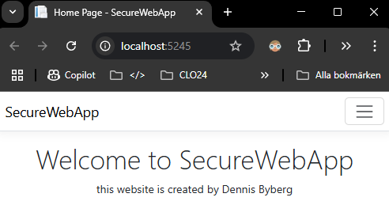

# SecureWebApp Tutorial 🛡️🔐

## Förutsättningar

Jag har precis avslutat utvecklingen av min webbapplikation skriven i .NET. Webbapplikationen är nu redo att driftsättas så att alla mina fans där ute på internet kan surfa till den och få den där wow-upplevelsen som de vet att de alltid får när jag släpper ny programkod - vilket jag gör ganska ofta.

Lite tråkigt är det emellertid att hackergruppen "Cloud Just Means Rain" ständigt ger sig på min sajt. Men med mitt senaste arbete kring säkerhet, så kommer de ingen vart.

## Uppgift

1. Jag ska designa en säker driftsmiljö för min webbapplikation.
2. Jag ska basera lösningen på virtuella servrar på Azure.
3. Jag ska beskriva vad de olika komponenterna i min design har för uppgift och syfte.
4. Jag ska beskriva vilka åtgärder jag vidtagit för ökad säkerhet.
5. Jag ska redogöra för vilka molntjänster jag utnyttjat.
6. Jag ska göra en tydlig avgränsning i min design och beskriva sedan steg för steg hur jag provisionerar driftsmiljön samt driftsätter min applikation.
7. Jag ska vara tydlig med vilka verktyg jag använder.
8. Jag ska beskriva hur jag använder IaC och automation - om jag gör det.
9. Jag ska förklara hur säkerheten påverkar min provisionering och driftsättning.

## Git & CI/CD

### Steg 1: Web-App redo för versionshantering.

Nu är vår webbapplikation redo för versionshantering och fungerar lokalt.



Vi ska nu gå igenom några steg för att ladda upp den till vårt GitHub-repo där vi kommer att versionshantera vår app.

Vi börjar med att skapa en `.gitignore`-fil för att undvika att ladda upp filer som vi inte behöver på `GitHub`.

```bash
dotnet new gitignore
```

Nästa steg är att initialisera vårt git-repo och göra vår första commit.

```bash
git init
```

```bash
git add .
```

```bash
git commit -m "Initial Commit"
```

Till sist, använd VSCode:s integrerade git-funktionalitet för att koppla ditt lokala repository till GitHub och pusha din första commit. Följ anvisningarna i VSCode för att autentisera och specificera dina repository-detaljer på GitHub.

När vi är klara borde vi ha vårt repo på GitHub:


<hr>

### Steg 2: Konfigurera CI-arbetsflödet

Nu ska vi ta detta till nästa nivå och sätta upp våran CI arbetsflöde

Vi börjar med att skapa en `cicd.yml` i `.github/workflows`

```yml
name: CI för SecureWebApp

on:
  push:
    branches:
      - 'master'
  workflow_dispatch:

jobs:
  build:
    runs-on: ubuntu-latest
    steps:
      - name: Installera .NET SDK
        uses: actions/setup-dotnet@v4
        with:
          dotnet-version: '9.0.x'

      - name: Checka ut detta repo
        uses: actions/checkout@v4

      - name: Återställ beroenden (installera NuGet-paket)
        run: dotnet restore

      - name: Bygg och publicera appen
        run: |
          dotnet build --no-restore
          dotnet publish -c Release -o ./publish

      - name: Ladda upp app-artifacts till GitHub
        uses: actions/upload-artifact@v4
        with:
          name: app-artifacts
          path: ./publish
```
